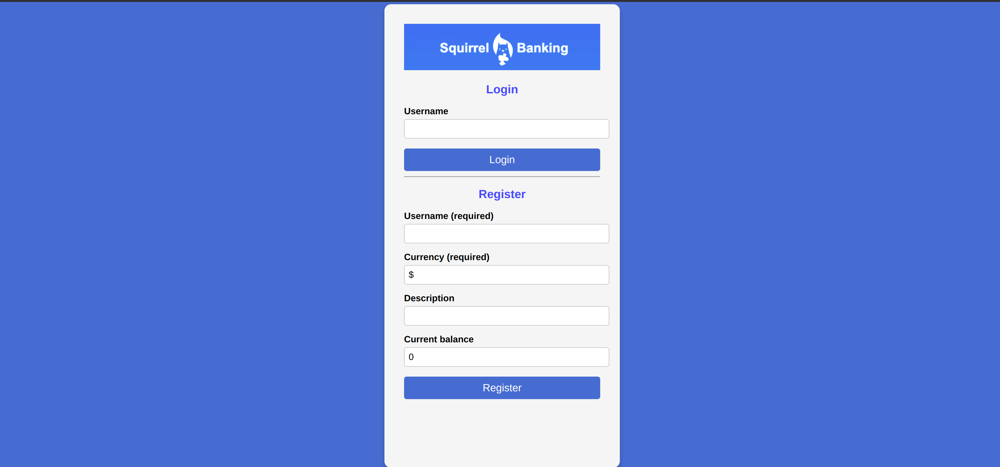

### HTML Templates and Routes in a Web App

## ASSIGNMENT
```js
const routes = {
  '/login': { templateId: 'login' ,title:'Bank login'},
  '/dashboard': { templateId: 'dashboard',title:'Bank dashboard',  init: refresh },
  '/credit': {templateId:'credit',title:'Bank credit'},
};
```
## CHALLENGE
***Added a new template and route for a third page that shows the credits for this app.***
```html
<template id="credits">
        <section id="creditsPage">
            <h2>Credits</h2>
            <p>By: Ayrus@25></p>
            <button onclick="showPage('transaction')">Back</button>
        </section>
    </template>
```
```js
function showCredits() {
            const template = document.getElementById('creditsTemplate');
            const clone = template.content.cloneNode(true);
            document.body.appendChild(clone);
        }
```
### Build a Login and Registration Form

## ASSIGNMENT
***Styling the  bank app using css.***
-An image is added to represent the logo of the app.
```css
body {
  font-family: Arial, sans-serif;
  background: rgb(58, 126, 205);
  display: flex;
  justify-content:center;
  align-items:center;
  height: 100vh;
  margin: 0;
}

.container {
  background: #f5f5f5;
  padding: 30px;
  border-radius: 10px;
  width: 300px;
  height:650px;
  text-align: center;
  left:50% ;
  box-shadow: 0px 4px 8px rgba(0, 0, 0, 0.2);
}
h1 {
  font-size: 26px;
  color: rgb(8, 157, 226);
  top:0%;
  margin-bottom: 10px;
}
h2 {
  font-size: 22px;
  color: rgb(58, 126, 205);
  margin-bottom: 15px;
}
label {
  display: block;
  text-align: left;
  font-weight: bold;
  margin: 10px 0 5px;

}
input {
  width: 100%;
  height: 50%;
  padding: 10px;
  margin-bottom: 5px;
  border: 1px solid #ccc;
  border-radius: 5px;
  font-size: 14px;
  left:60%;
}
button {
  width: 100%;
  padding: 12px;
  background-color: rgb(58, 126, 205);
  color: white;
  font-size: 16px;
  border: none;
  border-radius: 5px;
  left: 10%;
  cursor: pointer;
}
button:hover {
  background-color: rgb(8, 157, 226);
}
img{
  width: 300px;
}
```
The interface after styling:

## CHALLENGE
***Show an error message in the HTML if the user already exists.***
```html
<div id="error" hidden style="color: red;"></div>
```
```js
function showError(message) {
            const errorDiv = document.getElementById('error');
            errorDiv.textContent = message;
            errorDiv.hidden = false;
            }
```
### Methods of Fetching and Using Data
## ASSIGNMENT
Added comments and refactored app.js to improve the code quality.
Created  a constant to extract server api base URL,the createAccount function and getAccount function is regrouped to reudce the bulkiness of the code and the comments were added for the better understanding of the web app.
## CHALLENGE
```css
table {
  width: 100%;
  border-collapse: collapse;
  background: white;
  margin-top: 10px;
  border-radius: 8px;
  overflow: hidden;
}

th {
  background: #333;
  color: white;
  padding: 12px;
  text-align: left;
}

td {
  padding: 12px;
  text-align: left;
  font-size: 16px;
}
```

### Concepts of State Management
## ASSIGNMENT
```js
const API_BASE_URL = 'http://localhost:5000/api/accounts';
const STORAGE_KEY = 'savedUser'; //Changed storage key to only save user info

function updateState(property, newData) {
  state = Object.freeze({ ...state, [property]: newData });
  if (property === 'account') {
    localStorage.setItem(STORAGE_KEY, JSON.stringify({ user: newData.user })); // save only user info
  }
}
function init() {
  const savedUser = localStorage.getItem(STORAGE_KEY);
  if (savedUser) {
    const { user } = JSON.parse(savedUser);
    updateState('account', { user }); // Restores only user info
  }
  updateRoute();
}
```
## CHALLENGE
Implementing the transaction dialog box;
```html
<dialog id="transactionDialog">
    <h2>Add Transaction</h2>
    <form id="transactionForm">
        <label for="transactionDate">Date</label>
        <input id="transactionDate" type="date" required>

        <label for="transactionObject">Object</label>
        <input id="transactionObject" type="text" required>

        <label for="transactionAmount">Amount</label>
        <input id="transactionAmount" type="number" required>

        <button type="submit" id="okButton">OK</button>
        <button type="button" id="cancelButton">Cancel</button>
    </form>
</dialog>
```
Styling using CSS
```css
dialog {
  width: 280px;
  padding: 15px;
  border: none;
  border-radius: 8px;
  box-shadow: 0px 4px 8px rgba(0, 0, 0, 0.2);
  text-align: center;
}

h2 {
  color: #007bff;
  font-size: 18px;
}

label {
  display: block;
  margin: 8px 0 4px;
  font-size: 14px;
}

input {
  width: 100%;
  padding: 6px;
  border: 1px solid #ccc;
  border-radius: 4px;
}

button {
  margin-top: 10px;
  padding: 8px;
  border: none;
  border-radius: 4px;
  cursor: pointer;
  width: 100%;
}

#okButton {
  background: #007bff;
  color: white;
}

#cancelButton {
  background: red;
  color: white;
  margin-top: 5px;
}

button:hover {
  opacity: 0.8;
}
```
Enhancing interactivity using javascript
```js
const dialog = document.getElementById('transactionDialog');
document.getElementById('cancelButton').onclick = () => dialog.close();

document.getElementById('transactionForm').onsubmit = (event) => {
  event.preventDefault();
  console.log('Transaction:', {
    date: event.target.transactionDate.value,
    object: event.target.transactionObject.value,
    amount: event.target.transactionAmount.value
  });
  event.target.reset();
  dialog.close();
  }
  ```