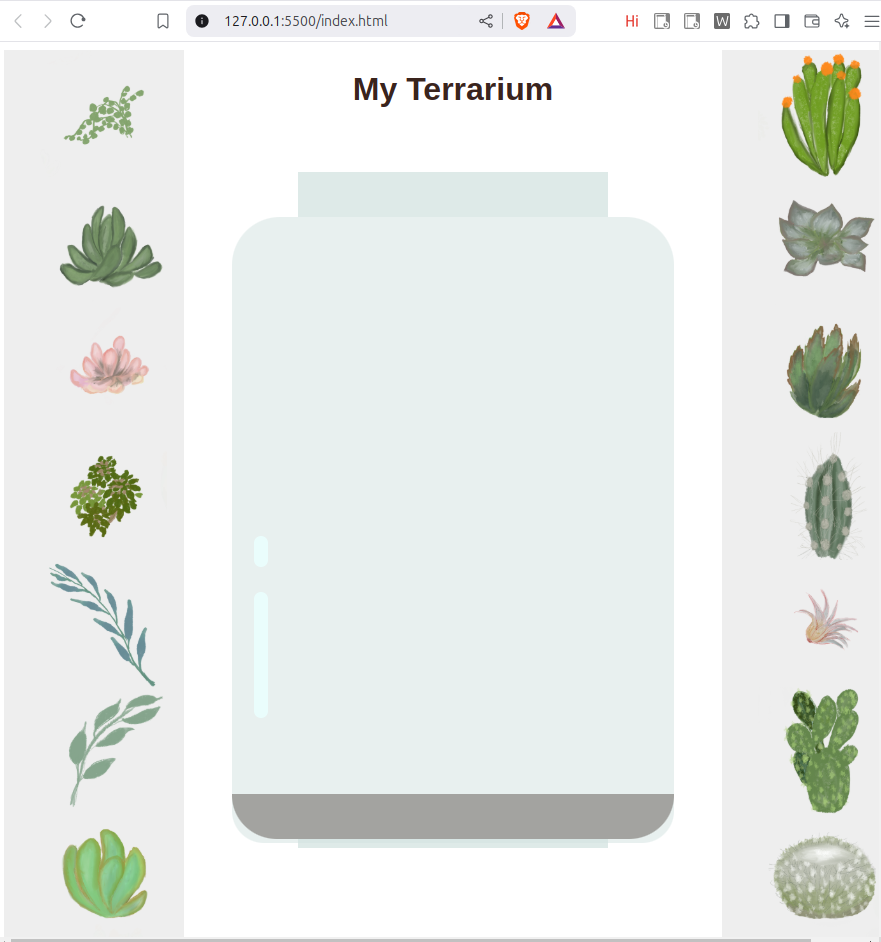

# Sub Topic 1

## Assignment

## Challenge

 There are some obselete and depracated tags. Depracated tags are those which are no longer recommended for use, mainly because they have been replaced by newer modern alternatives. While some browsers still support them, they might soon stop working and hence, they should be replaced as and when required. I have seen that marquee tag is one such tag, which has been recommended against using. The marquee tag causes the text to scroll either horizontally or vertically. While I found the marquee tag to be quite useful and helpful, it is recommended for no use because of the fact that the tag is of less use in real time applications and might be distacting. However, I found the tag interesting and the fact that it has attributed which enable it to slide or scroll, and then decide the direction of the scrolling along with its speed, makes it quite impressive. While there are no particular alternatives for marquee tag as such, we can use the CSS animations or javascript libraries like jQuery to perform the same functions.

# Sub Topic 2

## Assignment

 I have restyled the terrarium using flexbox, which includes flexibility and makes the code look relatively easier. Also using flexbox helps to arrange the elements in rows and columns, which can be later styled further, making our output be more satisfactory. The various attributes related to flex were interesting to use, along with attributes like justify-content and align-self, which I particularly used to center stage items, to make it more appealing. I further looked upon the features and difference of using flexbox, grid and bootstrap. While using grid lead to lot of difficulties in arranging things, flex was relatively much much easier to use and improved scalability.I also learnt about the position attributes which further made things easier.



## Challenge

For adding a bubble shine to the container, I was confused as from where to start styling, but later figured it out that I had to create a separate element which I should style using attributes like background colour, border, etc... Bubble shine gave the container a much needed boost,as it added some touch of realness. It made the container look as if something was getting reflected which was appealing.

```css
.jar-glossy-long{
	background: rgb(213, 252, 250);
	width: 3%;
	height: 20%;
	position: absolute;
	bottom: 20%;
	margin-left: 5%;
	border-radius: 3rem;
}

.jar-glossy-short{
	background: rgb(213, 252, 250);
	width: 3%;
	height: 5%;
	position: absolute;
	top: 51%;
	margin-left: 5%;
	border-radius: 3rem;
}```

# Sub Topic 3

## Assignment

## Challenge

```javascript
document.querySelectorAll('.plant').forEach(image => {
    image.addEventListener('dblclick', function() {

      this.style.zIndex = 100;
  
      document.querySelectorAll('.plant').forEach(otherImage => {
        if (otherImage !== this) {
          otherImage.style.zIndex = 2;
        }
      });
    });
});```

